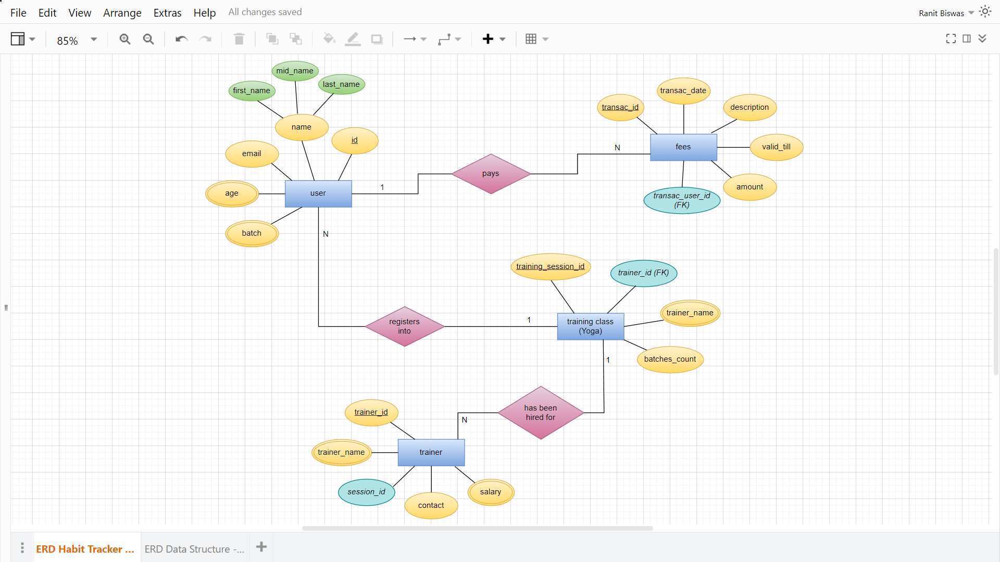

<h1 align="center">
  Yoga Form
</h1>
<p align="center"> Registration form to enroll into monthly Yoga Classes </p>

## 🚀 Featured APIs (🚧 working in progress 👨🏻‍🔧)
  * ``` POST /user ```
  * ``` GET /user ```
  * ``` POST /pay ```


## 👽 Technologies used
  * FastAPI (Microframework)
  * SQLAlchemy (ORM)
  * PostgreSQL (Database)

## 👁‍🗨 ER Diagram


<hr>

## 🛠 Installation

### Clone this repo
```
git clone "https://github.com/RhoNit/yoga-form.git"
```

<hr>

### Then go to the sub-directory ```/backend```
```
cd backend
```

<hr>

### Create and activate virtual environment
```
python -m venv new-env

.\new-env\Scripts\activate     # for Windows
source new-venv/bin/activate   # for Ubuntu and macOS
```

<hr>

### Install the packages inside requirements.txt
```
pip install -r requirements.txt
```

<hr>

### Run the application
```
uvicorn main:app --reload
```

<hr>

### Open it on ``` localhost:8000 ```
```
http://127.0.0.1:8000/       # 8000 is the default port to run FastAPI based application
```

<hr>

### API Documentation and test APIs on
```
https://127.0.0.1:8000/docs
```
